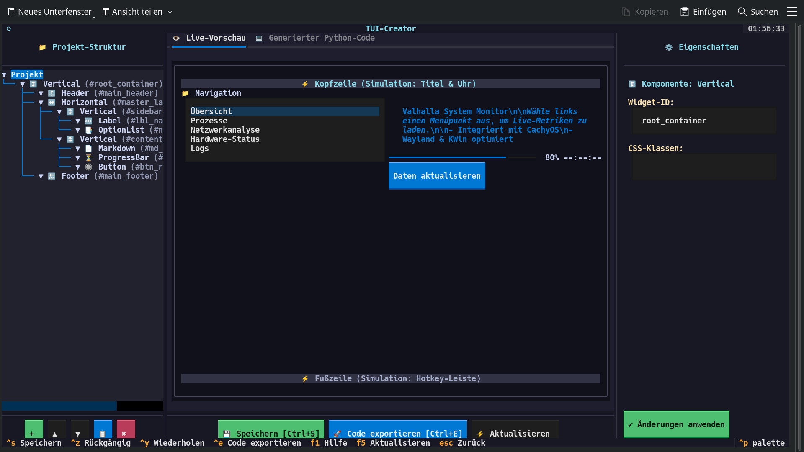
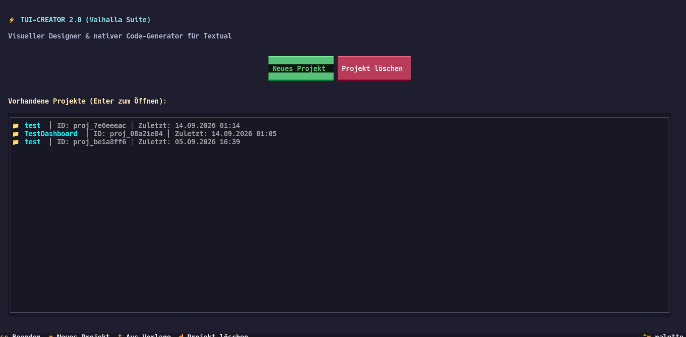

[🇩🇪 Zur deutschen Dokumentation wechseln](README_DE.md) | [🇬🇧 Switch to English Documentation](README.md)

# 🛠️ Textual TUI-Creator

[](https://github.com/Graba92/textual-tui-creator)
[](https://python.org)
[](https://python.org)
[](https://textual.textualize.io)
[](LICENSE)

<p align="center">
  
</p>
<p align="center">
  
</p>

**Textual TUI-Creator** ist ein interaktiver, visueller WYSIWYG-Editor und Code-Generator für [Textual](https://textual.textualize.io/)-basierte Terminal-Benutzeroberflächen (TUIs) in Python.

Er ermöglicht das intuitive Erstellen komplexer hierarchischer Layouts direkt im Terminal – inklusive Live-Vorschau, Eigenschafts-Inspektor und automatischem Export in sauberen, eigenständigen Python-Code.

---

## ✨ Features

- 🏗️ **Visueller Layout-Editor**: Interaktiver Aufbau hierarchischer Baumstrukturen (`Vertical`, `Horizontal`, `Container`).
- 🧩 **Reichhaltige Widget-Bibliothek**:
  - `Label`, `Button` (Primary, Success, Warning, Error)
  - `Input` (inkl. Platzhalter, Passwort-Modus)
  - `Checkbox`, `Select`-Dropdowns
  - `ProgressBar`, `LoadingIndicator`
  - `Rule` (Horizontale Trennlinien), `Header`, `Footer`
- ⚡ **Echtzeit Live-Vorschau**: Erlebe das gerenderte Textual-Interface in Echtzeit während des Designs.
- 🔍 **Eigenschaften-Inspektor**: Konfiguriere IDs, CSS-Klassen und widget-spezifische Optionen (Varianten, Tooltips, Vorgabewerte).
- 🐍 **Autonomer Python-Code-Export**: Generiert produktionsreifen Python-Code (`app.py`), der ohne Abhängigkeit zum Editor direkt ausgeführt werden kann.
- 💾 **Projektverwaltung & Verlauf**:
  - Automatisches Speichern und Laden von JSON-Projektdateien unter `~/.local/share/tui-creator/projects/`.
  - Vollständiges Undo/Redo (`Strg+Z` / `Strg+Y`).

---

## 🏛️ Projektstruktur

```text
textual-tui-creator/
├── tui_creator.py              # Direkter Starter
├── start_tui_creator.sh        # Ergonomisches Shell-Startskript
├── run.sh                      # Universal-Starter (automatische venv-Erkennung)
├── setup.sh                    # Indestructible Installations-Skript
├── requirements.txt            # Python-Abhängigkeiten
├── README.md                   # Englische Dokumentation
├── README_DE.md                # Deutsche Dokumentation (dieses Dokument)
├── .gitignore                  # Git-Ausschlussregeln
│
└── tui_creator/                # Python-Paket
    ├── __init__.py             # Paket-Initialisierung
    ├── __main__.py             # Modul-Einstiegspunkt
    ├── app.py                  # Textual App-Klasse & Routing
    ├── components.py           # Komponenten-Katalog & Widget-Definitionen
    ├── generator.py            # Code-Generator für Textual-Python-Code
    ├── models.py               # Datenmodelle für Layout-Knoten & Eigenschaften
    ├── storage.py              # Projekt-Speicherung (JSON) & Dateiverwaltung
    └── ui.py                   # Visuelle Editor-Screens, Baumansicht & Inspektor
```

---

## 🚀 Installation

### 1. Schnelleinrichtung (Empfohlen)

```bash
git clone https://github.com/Graba92/textual-tui-creator.git
cd textual-tui-creator
chmod +x setup.sh run.sh
./setup.sh
```

### 2. Nativ via Pacman (Arch Linux / CachyOS)

```bash
sudo pacman -S --needed python-textual
```

### 3. Manuell via Virtualenv

```bash
python3 -m venv venv
source venv/bin/activate
pip install -r requirements.txt
```

---

## 🖥️ Bedienung

### Editor starten
```bash
./run.sh
# oder
./start_tui_creator.sh
# oder
python3 tui_creator.py
```

### ⌨️ Tastaturkürzel im Editor

| Tastenkombination | Aktion |
| :---: | :--- |
| `Strg + S` | Projekt sofort speichern |
| `Strg + Z` | Rückgängig (Undo) |
| `Strg + Y` | Wiederholen (Redo) |
| `F1` | Hilfe & Schnellanleitung aufrufen |
| `Esc` | Zurück zum Startbildschirm / Menü |
| `Tab` / `Shift+Tab` | Zwischen Baum, Vorschau und Inspektor wechseln |

---

## 📄 Lizenz

Dieses Projekt ist lizenziert unter der [MIT-Lizenz](LICENSE).
